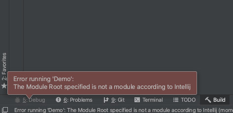

webapp-example
==============

## Steps to Reproduce

1. Import the project by: Idea -> File -> Open... -> Select the `example-root/build.gradle`
1. Go to Preferences -> Build, Execution, Deployment -> Build Tools -> Gradle, under the Gradle projects, change `Build and run using` from 'Gradle (Default)` to `IntelliJ IDEA`
1. Add a SmartTomcat configuration
1. Run the SmartTomcat
1. Error popup occurs.

